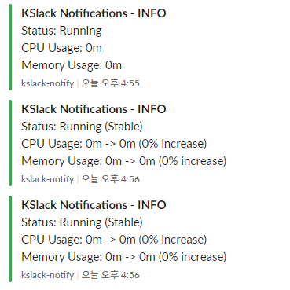
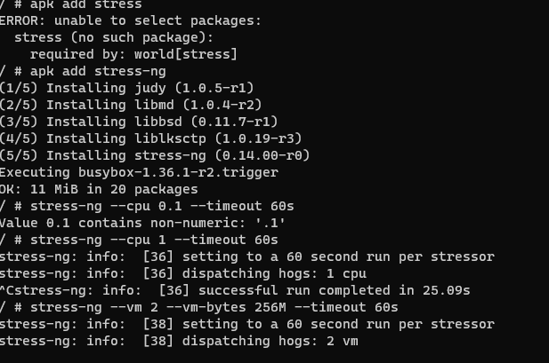
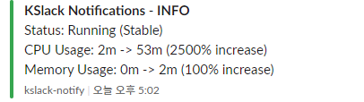

# KSlack

## _Small Watcher of Fully Managed Kubernetes_

KSlack is a project designed and developed to automatically and fully manage Kubernetes resources. Early-stage companies, not large teams, often lack infrastructure knowledge or find it challenging to manage Kubernetes. This project offers various services for these companies, such as automatically increasing or decreasing replicas, expanding PVCs, and monitoring Kubernetes resources for free, without any additional paid services, and receiving alerts on Slack.


### **warning:** This project is in a very early stage. It lacks many supported features, and we don't know what errors may occur.

When you start, you can receive notifications about log levels via Slack easily.


As an example, when using a stress tool, you can receive additional notifications based on the increase in metrics.



Used files
-busybox
```yaml
apiVersion: v1
kind: Pod
metadata:
  name: busybox
spec:
  containers:
  - name: busybox-container
    image: alpine
    command: ["sleep", "3600"]
```

-confg yaml(webhook.yaml)
```yaml
busybox:
  type: Pod
  label: "busybox"
  namespace: "default"
  interval: 30
  logging: true
  logging_level: 1
  limit_memory_usage: 100
  limit_cpu_usage: 100
  slack_url: "https://your-incoming-webhook-url"
```