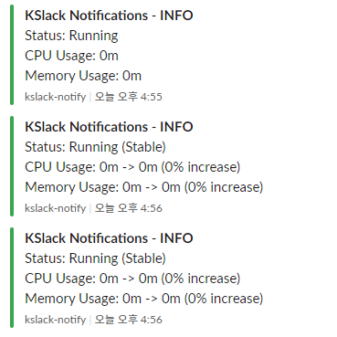
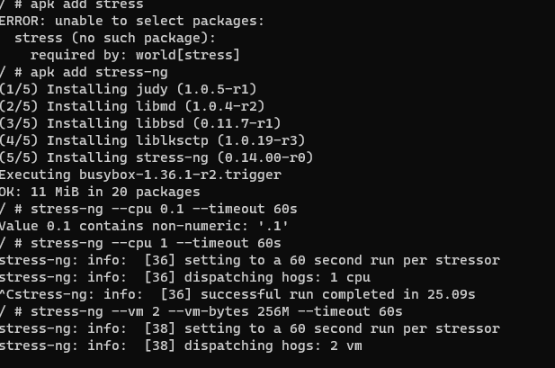
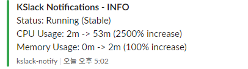

## IZONE with SLACK
1. [Pod](#pod)
2. [Deployment]
3. [Statefulset]
4. [PersistentVolume]

<a name="pod"></a>
## Pod
When you start, you can receive notifications about log levels via Slack easily.


As an example, when using a stress tool, you can receive additional notifications based on the increase in metrics.



Used files
-busybox
```yaml
apiVersion: v1
kind: Pod
metadata:
  name: busybox
spec:
  containers:
  - name: busybox-container
    image: alpine
    command: ["sleep", "3600"]
```

-confg yaml(izone.yaml)
```yaml
busybox:
  type: Pod
  label: "busybox"
  namespace: "default"
  interval: 30
  logging: true
  logging_level: 1
  limit_memory_usage: 100
  limit_cpu_usage: 100
  slack_url: "https://your-incoming-webhook-url"
```